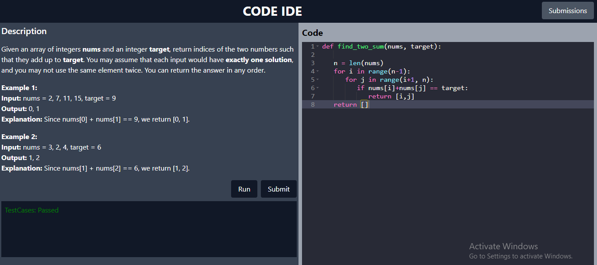

# IDE Project

This project is a web-based Integrated Development Environment (IDE) developed using Django and React.js. It provides features for code execution, code evaluation, submission handling, and more.

# Supported Languages

- Python

## Features

- **Code Evaluation**: Provides a platform for evaluating code with predefined test cases.
- **Submission Handling**: Manages user submissions and provides feedback.

## Project Structure

The project is organized into several parts:

### Backend (Django)

The backend is developed using Django and consists of several Django apps:

- **code_evaluation**: Manages code evaluation and test cases.
- **submission_handling**: Manages user submissions and feedback.

### Frontend (React.js with Vite)

The frontend is developed using React.js with Vite and is located in the `frontend/client` directory.

## Getting Started

### Backend

1. Clone the repository:

    ```bash
    git clone <repository-url>
    ```

2. Navigate to the project directory:

    ```bash
    cd IDE
    ```

3. Install backend dependencies:

    ```bash
    pip install -r requirements.txt
    ```

4. Apply migrations:

    ```bash
    python manage.py migrate
    ```

5. Run the development server:

    ```bash
    python manage.py runserver
    ```

6. Access the backend in your web browser at `http://localhost:8000`.

7. For example   

## Contributing

Contributions are welcome! If you'd like to contribute to this project, please follow these steps:

1. Fork the repository.
2. Create your feature branch: `git checkout -b feature/my-feature`.
3. Commit your changes: `git commit -m 'Add some feature'`.
4. Push to the branch: `git push origin feature/my-feature`.
5. Submit a pull request.

